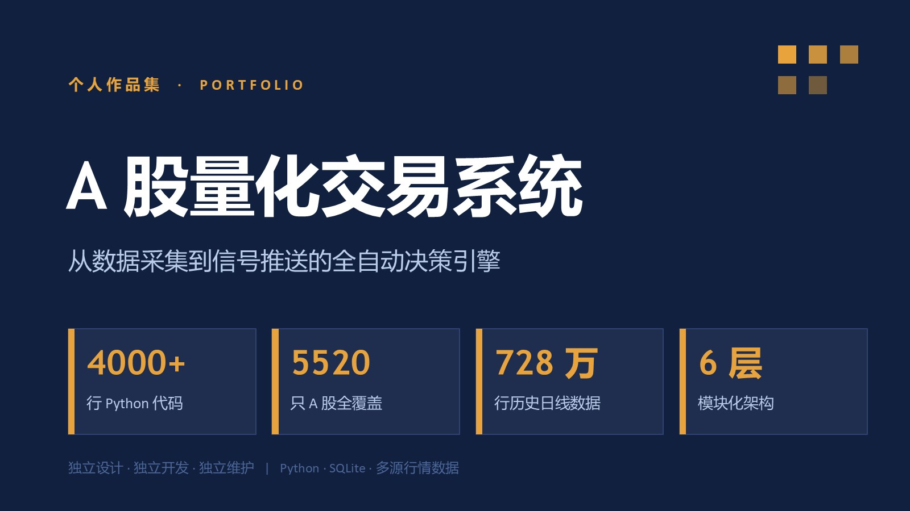
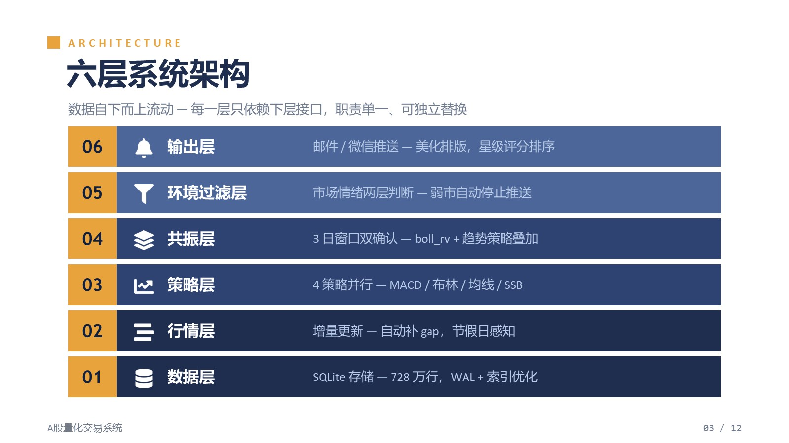
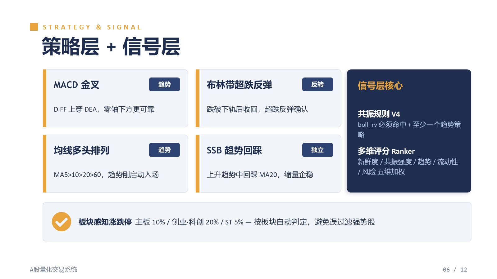
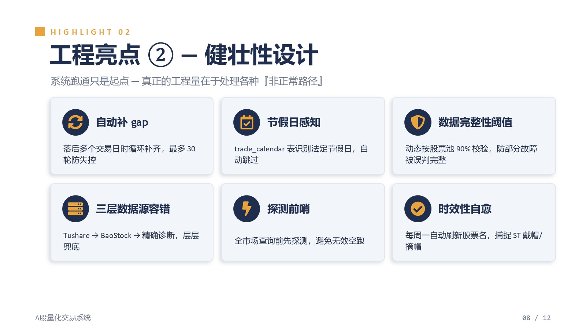
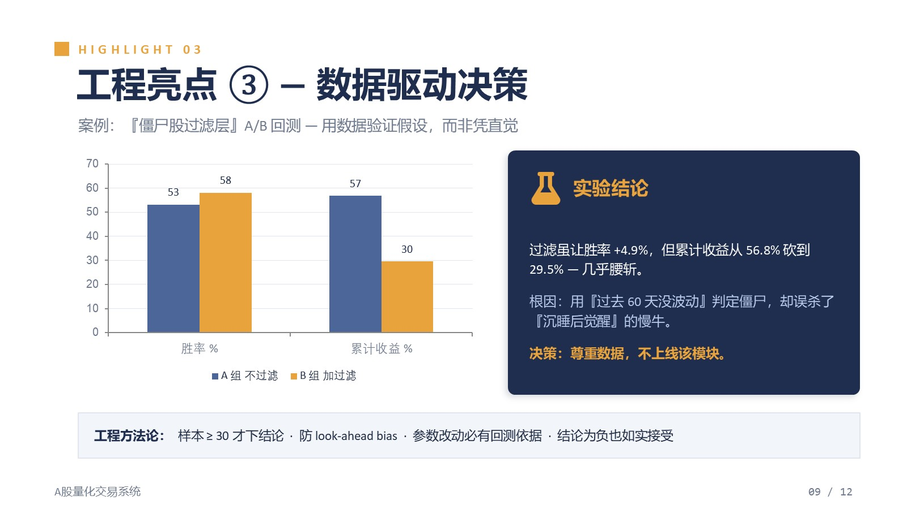
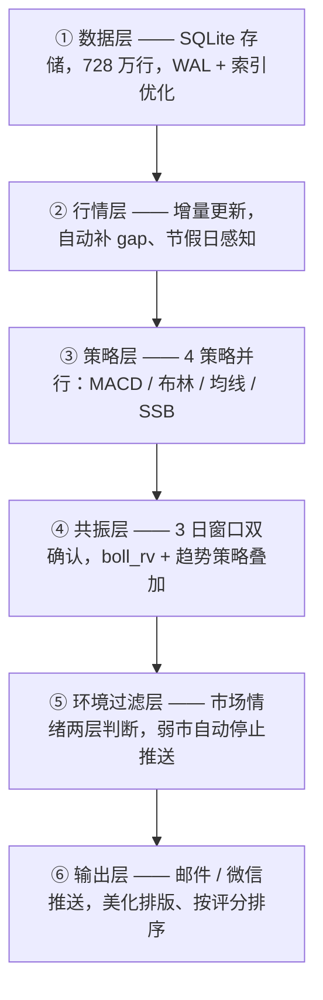

# A 股量化交易系统

> 一名**非科班转行开发者**，借助 **Claude / Claude Code** 从零搭建并持续迭代的全自动 A 股量化决策系统。
>
> 每日盘后自动拉取全市场行情 → 多策略扫描 → 多维评分 → 邮件推送信号。**系统选股，人工拍板。**




> 📄 **配套产品文档**：[《A 股散户量化决策 —— 需求分析报告》](docs/需求分析报告.md) —— 从用户需求与竞品角度拆解本项目
> 🖼 **作品集 PPT**：[`demo/量化系统作品集.pptx`](demo/) ｜ 🎬 **演示脚本**：[`docs/演示视频脚本.md`](docs/演示视频脚本.md)

---

## 目录

- [一、项目简介](#一项目简介)
- [二、这个项目想说明什么](#二这个项目想说明什么)
- [三、系统架构](#三系统架构)
- [四、技术栈](#四技术栈)
- [五、核心功能](#五核心功能)
- [六、AI 协作开发实录](#六ai-协作开发实录)
- [七、工程实践亮点](#七工程实践亮点)
- [八、快速开始](#八快速开始)
- [九、项目结构](#九项目结构)
- [十、说明与边界](#十说明与边界)

**📂 配套文档**：[《需求分析报告》](docs/需求分析报告.md)　｜　[演示视频脚本](docs/演示视频脚本.md)

---

## 一、项目简介

这是一套**全自动的 A 股量化决策辅助系统**。它解决一个具体问题：A 股 5500+ 只股票，人工不可能每天看完——让程序每天盘后自动扫描全市场，把符合策略的标的挑出来、打分排序，推送到我的邮箱。

- **覆盖范围**：全 A 股 5500+ 只股票
- **数据规模**：728 万行日线数据，覆盖 2020 年至今
- **运行方式**：每日 17:30 一键运行，约 80 秒完成全流程
- **定位**：半自动决策助手——系统负责"海选 + 排序"，最终买卖由人判断
- **代码规模**：约 1.1 万行 Python，56 个模块（核心系统 + 策略研究脚本），六层架构

**关于我**：非科班出身、转行做开发。这套系统是我借助 AI 编程工具，从零开始一行行搭出来、并持续迭代维护的。它不是教程项目，是真实在用、每天在跑的系统。

### 📸 项目速览

| | |
|:---:|:---:|
| **六层系统架构** | **策略层 + 信号层** |
|  |  |
| **健壮性设计** | **数据驱动决策：A/B 回测** |
|  |  |

> 上图取自项目作品集 PPT。完整 12 页见 [`demo/`](demo/) 目录。

---

## 二、这个项目想说明什么

这个仓库**不是想证明"量化策略能赚多少钱"**——策略是否盈利需要长期实盘检验，我不夸大这一点（见 [第十节](#十说明与边界)）。

它想说明的是另一件事：

> **一个非科班开发者，借助 AI 工具，能把一个工程项目做到什么完成度。**

所以这个 README 花了很大篇幅写 [**第六节：AI 协作开发实录**](#六ai-协作开发实录)——因为对我来说，"怎么和 AI 一起把它做出来"，比"它本身"更值得讲。整个系统从架构设计、性能优化、bug 排查到 A/B 实验验证，全程是 **Prompt 驱动 + AI 工作流**的产物。

此外，本项目配有一份 [**《A 股散户量化决策 —— 需求分析报告》**](docs/需求分析报告.md)——从"发现需求 → 定义用户 → 竞品分析 → 产品方案 → 迭代规划"完整拆解这个项目。**代码证明工程实现能力，需求分析证明产品思维**——两者合起来，才是一个产品工程师应有的完整闭环。

---

## 三、系统架构

数据自下而上流动，每一层只依赖下层接口——职责单一、可独立替换、可独立测试。



| 层 | 职责 | 关键设计 |
|----|------|---------|
| ① 数据层 | 全市场日线存储与查询 | SQLite WAL 模式；`trade_date` 索引；批量写入 |
| ② 行情层 | 每日增量更新 | 三数据源容错；自动补多日 gap；交易日历感知节假日 |
| ③ 策略层 | 信号生成 | 4 个独立策略，统一 `generate_signals()` 接口 |
| ④ 共振层 | 多策略叠加确认 | 3 日窗口，反转策略 + 趋势策略双确认 |
| ⑤ 环境过滤层 | 大盘风险控制 | 市场广度 + 趋势两层判断，弱市不推送 |
| ⑥ 输出层 | 信号交付 | SMTP 邮件 / Server酱微信，多维评分排序 |

---

## 四、技术栈

| 类别 | 选型 | 说明 |
|------|------|------|
| 语言 | Python 3.12 | pandas / numpy 向量化计算 |
| 存储 | SQLite（WAL 模式） | 单库 1.3 GB，读写不阻塞，`trade_date` 索引加速 |
| 数据源 | Tushare（主）/ BaoStock（备）/ akshare | 三源容错切换 |
| 推送 | SMTP 邮件 / Server酱微信 | 标准库 `smtplib`，无额外依赖 |
| 调度 | Windows 计划任务 / `run_daily.bat` | 一键全流程 |
| 配置 | `.env` + `python-dotenv` 风格自加载 | 密钥与代码分离 |

---

## 五、核心功能

**数据管线**
- Tushare 一次 API 取全市场日 K；失败自动切 BaoStock 逐股拉取
- 落后多个交易日时自动循环补齐（最多 30 轮防失控）
- 通过交易日历表识别法定节假日，自动跳过

**4 个交易策略**（趋势 + 反转互补）

| 策略 | 类型 | 核心逻辑 |
|------|------|---------|
| MACD 金叉 | 趋势 | DIFF 上穿 DEA，零轴下方更可靠 |
| 布林带超跌反弹 | 反转 | 跌破下轨后收回，超跌反弹确认 |
| 均线多头排列 | 趋势 | MA5 > 10 > 20 > 60，趋势刚启动时入场 |
| SSB 趋势回踩 | 独立 | 上升趋势中回踩 MA20，缩量企稳 |

**共振池**——`boll_rv 命中` + `至少一个趋势策略命中`，3 日窗口内双确认才进精选池

**多维评分**——共振池每只股票按 5 个维度加权打分（信号新鲜度 / 共振强度 / 趋势对齐 / 流动性 / 风险），输出 0~1 评分 + 风险标签

**回测引擎**——严格 A 股规则建模：T+1、按板块/ST 判定涨跌停、真实手续费（佣金 + 印花税 + 最低 5 元）

**信号推送**——美化排版的邮件，每只股票带星级评分，重点信号优先排序

---

## 六、AI 协作开发实录

> **这是本 README 的核心章节。** 整个系统是 Prompt 驱动 + AI 工作流的产物，下面如实记录这个过程。

### 6.1 工具与工作流

主力工具是 **Claude / Claude Code**（命令行 Agent 模式）。我的基本工作流：

```
我提出需求 / 观察到问题
        ↓
AI 分析 → 给出 2-3 个方案 + 取舍
        ↓
我做技术决策（选哪个方案）
        ↓
AI 实现代码
        ↓
我验证（跑回测 / 对照数据 / 看实际效果）
        ↓
确认通过 or 打回重来
```

关键是——**AI 负责"实现"，我负责"提问、决策、验证"**。我不会让 AI 一次性梭哈，而是把它当成一个需要我把关的协作者。

### 6.2 我的 Prompt 方法论 / 协作纪律

在长期使用中我固化了几条纪律，用来约束 AI、也约束自己：

1. **分阶段推进**——大改动拆成几个阶段，每阶段完成后停下来 review，确认无误再继续。不允许 AI 一次性改一大片。
2. **要方案、不要拍板**——要求 AI 给 2-3 个方案并说明取舍，最终技术决策由我做。
3. **改动必有依据**——任何参数、逻辑的改动，必须有回测或实测数据支撑，不接受"我觉得这样更好"。
4. **样本不足不下结论**——回测样本 < 30 笔时不下任何结论（曾因 12 笔样本草率下结论被数据打脸）。
5. **防未来函数**——回测时严格只用截止当日的数据，杜绝 look-ahead bias。

这套纪律本身就是在和 AI 反复协作中打磨出来的。

### 6.3 典型协作案例

下面是 4 个真实的"人 + AI"协作循环：

**案例 1 ｜ 性能优化：定位瓶颈 → 实测 100 倍提速**
我观察到每日扫描偏慢，让 AI 定位瓶颈。AI 指出问题在"逐股查询"——5499 次单股 SQL 是 I/O 密集。方案：改成一次性批量加载 + 内存 `groupby`，叠加 SQLite WAL 模式 + `trade_date` 索引。实测单日全市场广度查询从 100-500ms 降到 **< 1ms**。我的角色：提出"慢"这个观察，并在改完后对照新旧信号结果完全一致才确认。

**案例 2 ｜ 数据驱动证伪：用 A/B 回测否决自己的想法**
我提出一个假设——"加一层僵尸股过滤，剔除低活跃度股票，应该能提升收益"。AI 帮我搭了 A/B 回测框架（500 只 × 240 天）。结果出乎意料：过滤虽让胜率 +4.9%，但累计收益从 56.8% **砍到 29.5%**——几乎腰斩。根因是"用过去 60 天没波动判定僵尸"，误杀了"沉睡后觉醒"的慢牛。**最终决策：尊重数据，不上线这个模块。** 这个案例教会我——假设要用数据验证，结论为负也要如实接受。

**案例 3 ｜ bug 定位：领域直觉 + AI 代码排查**
某天信号池里出现了 ST 股（按规则本该被过滤）。我凭经验觉得"不对劲"，让 AI 排查。AI 顺藤摸瓜定位到根因：股票名称表 5 周没刷新，新戴帽的 ST 股系统还认作正常股。修复 + 增加"每周一自动刷新股票名"机制。**人提供领域直觉，AI 提供代码定位能力**——这是协作的典型分工。

**案例 4 ｜ 卡死诊断：从现象到根因**
日常更新脚本某次卡了 15 分钟。AI 诊断出：节假日时主数据源返回空，备用数据源却"盲目"地把 5499 只股票全查了一遍。解决方案：加"探测前哨"（先探 2 只大盘股，空就立即放弃）+ 引入交易日历表识别节假日。节假日场景耗时从 45 分钟降到 **15 秒**。

### 6.4 AI 带来的真实提效

- **架构能力补全**：非科班的我，借助 AI 完成了六层解耦架构的设计——这是我独立做不到的
- **排查效率**：bug 从"现象"到"根因"通常一两轮对话定位，靠自己可能要卡几天
- **工程规范**：`.env` 密钥管理、SQL 参数化、日志规范等工程实践，是在 AI 的 code review 中逐步建立的（一次系统性审查扫出 12 个 bug 并分级修复）

### 6.5 踩过的坑

- **不能全信 AI**：AI 给的"优化"有时不经验证就是错的——所以才有了"改动必有回测依据"这条纪律
- **小样本陷阱**：曾用 12 笔回测样本下结论，扩到 47 笔后结论反转——AI 不会主动拦你，纪律得自己立
- **包名冲突**：项目里有个包叫 `signal`，和 Python 标准库同名，某次引入新库时才暴露——AI 帮忙定位后重命名解决

---

## 七、工程实践亮点

**性能优化**
- 批量查询替代循环单查：5499 次单股 SELECT → 1 次全量加载 + 内存分组
- SQLite WAL 模式 + 索引：单日广度查询 100 倍提速
- `executemany` 批量写入：逐行 INSERT → 单事务批量提交，写入快 5-10 倍

**健壮性设计**
- 三层数据源容错链：Tushare → BaoStock 探测 → 精确诊断
- 自动补 gap：落后多个交易日时循环补齐
- 节假日感知 / 数据完整性动态阈值 / ST 状态自动刷新

**数据驱动决策**
- 关键改动均有 A/B 回测支撑
- 严格区分样本内 / 样本外，防过拟合
- 结论为负也如实接受（见案例 2）

---

## 八、快速开始

```bash
# 1. 安装依赖
pip install -r requirements.txt

# 2. 配置密钥（复制模板后填入自己的）
cp .env.example .env
# 编辑 .env，填入 TUSHARE_TOKEN、邮箱 SMTP 等

# 3. 首次建库（拉取全市场历史数据，耗时较长）
python run_init_database.py

# 4. 日常运行（每日盘后 17:30 后执行）
python run_daily_update_v2.py   # 更新当日数据
python run_signal_scan.py       # 扫描信号并推送

# 或一键运行
run_daily.bat
```

> ⚠️ 所有密钥通过 `.env` 管理，已在 `.gitignore` 中排除，不会进入版本库。

---

## 九、项目结构

```
quant_system/
├── config.py                 # 全局配置 + .env 自加载
├── data/                     # 数据层
│   ├── storage.py            # SQLite 接口
│   ├── fetcher_daily.py      # 日线拉取（Tushare / BaoStock）
│   ├── market_filter.py      # 市场环境过滤
│   ├── limit_rules.py        # 板块 / ST 涨跌停规则
│   └── trade_calendar.py     # 交易日历
├── research/strategies/      # 策略层（4 个策略）
├── signals/                  # 信号层
│   ├── scanner.py            # 全市场扫描 + 共振池 + 推送
│   └── ranker.py             # 多维评分
├── backtest/                 # 回测层（引擎 / 指标 / 报告）
├── run_daily_update_v2.py    # 日常数据更新入口
├── run_signal_scan.py        # 信号扫描入口
└── run_resonance_backtest.py # 共振策略历史回测
```

---

## 十、说明与边界

为保持诚实，明确以下几点：

- 本项目是**个人学习与工程实践**的产物，**不构成任何投资建议**
- 系统输出的是"信号"，不自动下单——最终买卖决策由人做出
- 策略的盈利性**未经长期实盘验证**，回测结果不代表未来表现
- 本仓库展示的核心是**工程能力与 AI 协作开发过程**，而非策略本身的收益
- 所有密钥、个人配置已脱敏处理，通过 `.env` 管理且不进版本库

---

<sub>本系统由非科班开发者借助 Claude / Claude Code 独立设计、开发、维护。欢迎就架构设计与 AI 协作开发方式交流。</sub>
